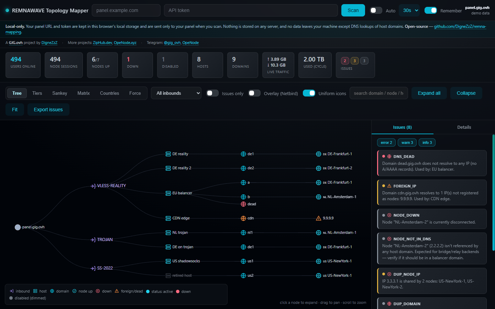
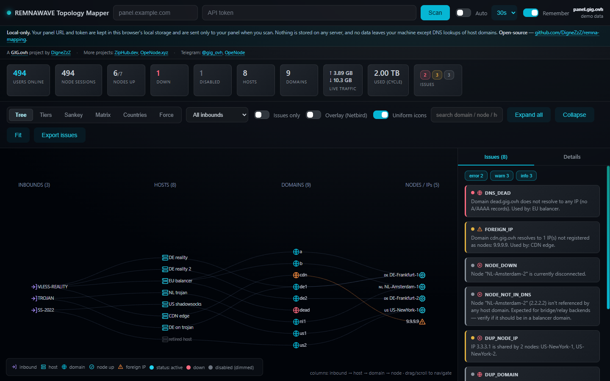
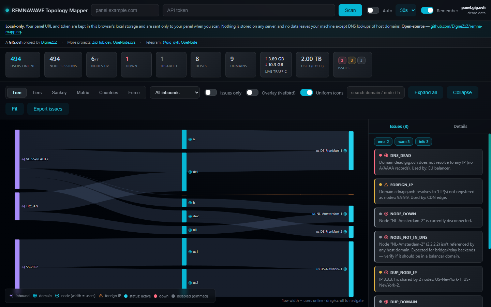
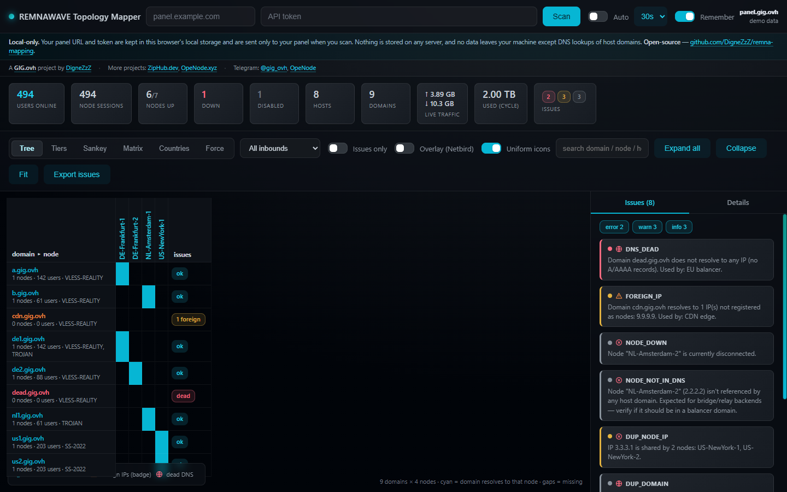
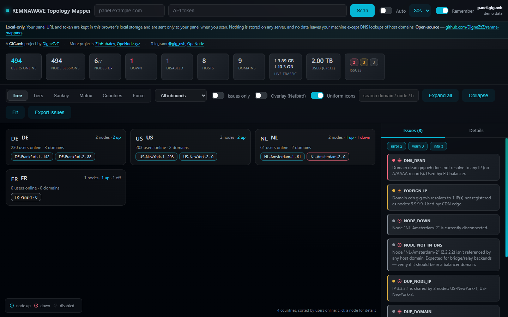
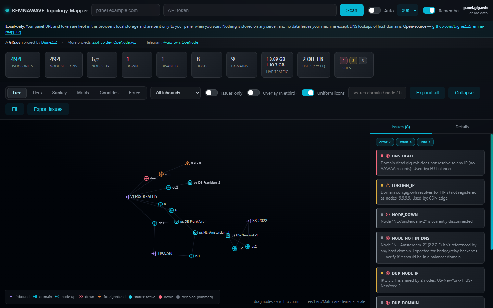

# REMNAWAVE Topology Mapper


A small web service for Remnawave panels. Enter your **panel URL** and **API token**, and it:

- pulls every **host** (connection entry points / domains) and every **node** (servers / IPs) from the panel,
- **resolves each host domain via DNS** and matches the resulting IPs against your nodes,
- **visualizes** the whole **host → domain → IP → node** relationship across **six views** (tree, tiers, sankey, matrix, by-country, force) on a dark canvas — with **entity icons**, **per-element status** (active / down / disabled), live **users online**, and **traffic** (cumulative usage + live per-inbound throughput),
- flags **inconsistencies**: dead DNS, IPs not registered as nodes, stale IP hosts, backend nodes no domain points to, shared node IPs, partial balancers, cross-inbound domain reuse, and nodes near/over their traffic limit.

It's built for the exact layout you have in Granit: hosts carry subdomains (sometimes comma-separated balancer lists), nodes carry IPs, and a host's public IP can live in either the node's `address` or its `name` — the matcher checks both.

## Author & related projects

A **[GIG.ovh](https://gig.ovh)** project by **[DigneZzZ](https://github.com/DigneZzZ)**.

- Other projects: **[ZipHub.dev](https://ziphub.dev)** · **[OpeNode.xyz](https://openode.xyz)**
- Telegram: **[GIG.ovh — @gig_ovh](https://t.me/gig_ovh)** · **[OpeNode group](https://t.me/+I57W0d7XyuE5ODQy)**

## Quick start (Docker)

```bash
docker compose up --build -d
# open http://localhost:8088
```

Then in the UI:
1. Panel URL — e.g. `panel.me.pro` (scheme optional).
2. API token — a Remnawave API-role token (Bearer).
3. **Scan**. Toggle **Auto** for periodic refresh (15s–2m).

To change the exposed port, edit the `ports:` mapping in `docker-compose.yml`.

### Without compose

```bash
docker build -t vpn-topology-mapper .
docker run -d -p 8088:8088 --name vtm vpn-topology-mapper
```

### Without Docker (Node ≥ 18)

```bash
node server.js          # http://localhost:8088
PORT=9000 node server.js
node --test             # run the test suite (zero-dep, built-in node:test)
```

Zero runtime dependencies — the backend is a single `server.js`, the UI a single self-contained `public/index.html` (D3 + d3-sankey from CDN). No build step.

## Views & controls

<table>
  <tr>
    <td align="center"><br><sub><b>Tree</b> — collapsible inbound → host → domain → node</sub></td>
    <td align="center"><br><sub><b>Tiers</b> — layered columns</sub></td>
  </tr>
  <tr>
    <td align="center"><br><sub><b>Sankey</b> — flow, link width = users online</sub></td>
    <td align="center"><br><sub><b>Matrix</b> — domain × node grid</sub></td>
  </tr>
  <tr>
    <td align="center"><br><sub><b>Countries</b> — grouped by country</sub></td>
    <td align="center"><br><sub><b>Force</b> — clustered graph</sub></td>
  </tr>
</table>

<sub>(screenshots use synthetic demo data)</sub>

Pick a layout from the toolbar — each renders the same scan a different way:

| View | Shows |
|---|---|
| **Tree** | Collapsible hierarchy `inbound → host → domain → node` (use **Expand all** / **Collapse**). |
| **Tiers** | Layered columns: inbounds → hosts → domains → nodes/IPs. |
| **Sankey** | Flow diagram; link width = users online. |
| **Matrix** | `domain × node` grid — a green cell means that domain resolves to that node. |
| **Countries** | Nodes grouped by country, sorted by users online. |
| **Force** | Clustered force-directed graph (in Overlay it clusters as a star per inbound). |

Every element carries an **entity icon** (inbound / host / node / domain / IP) and a **status**: active, **down** (disconnected), or **disabled/hidden** (dimmed + greyed); domains show **ok / dead / foreign**. Click any element for a detail panel (IPs, inbounds, traffic, what it connects to). Click the **⧉** beside an IP or domain to copy it.

Toolbar:
- **Filter by inbound** and **Issues only** to narrow the graph.
- **Overlay (Netbird)** — for panels whose nodes use private/overlay IPs (e.g. Netbird) that your domains don't resolve to: match domain → node by **shared inbound** instead of public IP, and stop flagging the public IPs as foreign. Leave **off** for normal panels with public node IPs.
- **Uniform icons** (on by default) — fixed-size entity icons; turn **off** to scale node size by users-online.
- **Search** domains / nodes / hosts · **Fit** resets zoom · **Export issues** downloads a CSV of issues + a JSON of the full topology.
- **Auto** re-scans every 15s–2m · **Remember** stores the URL + token in this browser's `localStorage` only.

The UI is responsive — on narrow screens the side panel becomes a drawer (toggle bottom-right). Drag to pan, scroll to zoom.

## How the matching works

| Entity | Source field | Used as |
|---|---|---|
| Host domain | `host.address` (split on commas) | resolved via DNS to A **and AAAA** records |
| Host IP | `host.address` literal IP | matched directly to a node |
| Node public IP | `node.address` **and** `node.name` (when it's an IP) | match target for resolved IPs |
| Host ↔ inbound | `host.inbound.configProfileInboundUuid` | logical grouping |
| Node ↔ inbound | `node.configProfile.activeInbounds[].uuid` | which nodes serve a host |

A resolved IP that equals a node's public IP draws a green **DNS match** link. Anything else is surfaced as an issue. Both **IPv4 and IPv6** are matched: domains are resolved for A and AAAA records, and an IPv6 in a node's `address`/`name` is a valid match target.

## Traffic & activity

Each scan also pulls **live throughput** per `(node × inbound)` from `/api/system/nodes/metrics` and **cumulative usage** (`trafficUsedBytes` / `trafficLimitBytes`) from `/api/nodes`. Traffic is shown in the stats header (total ↑/↓ and used-this-cycle) and in the node / host / inbound detail panels. A host's traffic is attributed through its `host → inbound → node` chain — exact per-host only when an inbound has a single host, otherwise it's the inbound's traffic grouped under its hosts. Everything stays within the panel's existing API; nothing is probed or persisted.

## Detected issues

| Type | Severity | Meaning |
|---|---|---|
| `DNS_DEAD` | error | A host domain doesn't resolve at all (NXDOMAIN / no A or AAAA record). |
| `HOST_NO_NODES` | error | A host's inbound has no node serving it. |
| `TRAFFIC_EXCEEDED` | error | A traffic-tracked node has used ≥ its traffic limit. |
| `FOREIGN_IP` | warn | A domain resolves to an IP that isn't registered as any node (extra DNS record, CDN/relay, or a server missing from the panel). |
| `STALE_IP_HOST` | warn | A host is configured with a raw IP that isn't any node. |
| `PARTIAL_BALANCER` | warn | A multi-address (comma-separated) host where some members are healthy but at least one is dead or foreign. |
| `DUP_NODE_IP` | warn | Two or more nodes share the same public IP. |
| `TRAFFIC_NEAR_LIMIT` | warn | A node reached its notify threshold (`notifyPercent`, default 80%) of its traffic limit. |
| `NODE_DOWN` | info | Node currently disconnected. |
| `NODE_NOT_IN_DNS` | info | An enabled node serves a domain-backed inbound but no host domain resolves to its IP. Often legitimate for bridge/relay backends — verify it isn't a node missing from a balancer domain. |
| `DUP_DOMAIN` | info | The same domain is used across more than one **different** inbound. Verify it's intentional (same-inbound reuse is not flagged). |

## Security

- The token is sent only to **your** panel (server-side, to avoid browser CORS) and is **never stored on disk** or sent to any third party.
- DNS resolution uses the host's system resolver first (A and AAAA). If a name fails, it falls back to DNS-over-HTTPS (`dns.google`, A + AAAA) — only the **hostname** is sent, never the token. Disable with `DOH=0`.
- "Remember" in the UI stores the URL + token in your browser's `localStorage` only. Untick it on shared machines.

## Env vars

| Var | Default | Purpose |
|---|---|---|
| `PORT` | `8088` | HTTP listen port |
| `DOH` | `1` | DNS-over-HTTPS fallback on/off |
| `DNS_TIMEOUT_MS` | `4000` | per-name DNS timeout before fallback |
| `DNS_CONCURRENCY` | `20` | max in-flight DNS lookups per scan (bounded fan-out) |
| `RESOLVE_TTL_MS` | `30000` | DNS result cache TTL in ms (`0` disables) |
| `RESOLVE_CACHE_MAX` | `20000` | cached hostnames before prune/clear |
| `MAX_CONCURRENT_SCANS` | `20` | concurrent scans before requests queue |
| `MAX_SCAN_QUEUE` | `200` | queued scans beyond which `/api/scan` returns `503` |
| `SCAN_TIMEOUT_MS` | `30000` | overall per-scan cap before `504` |

## API

`POST /api/scan` with JSON `{ "panelUrl": "...", "token": "..." }` returns the full topology graph + issues (the same payload the UI renders), so you can script against it too.

## Run from GitHub Container Registry (no build)

A multi-arch image (amd64 + arm64) is built and pushed to GHCR automatically by GitHub Actions on every push to the default branch.

```bash
docker compose -f docker-compose.ghcr.yml up -d
# open http://localhost:8088
```

This pulls `ghcr.io/dignezzz/remna-mapping:latest`. If your GitHub user/org differs, edit the `image:` line in `docker-compose.ghcr.yml`.

**First publish:** after the first successful Actions run, open the repo on GitHub -> Packages -> the `remna-mapping` package -> Package settings -> change visibility to **Public** so `docker pull` works without authentication. Available tags: `latest`, branch name, `sha-<short>`, and `vX.Y.Z` for git tags.

## CI / auto-build

`.github/workflows/docker-publish.yml` logs in with the built-in `GITHUB_TOKEN` (no secrets to set up), builds for `linux/amd64` + `linux/arm64`, and pushes to `ghcr.io/<owner>/remna-mapping` on:
- push to `main`/`master` -> updates `:latest`
- a `v*` git tag -> publishes `:vX.Y.Z`
- manual run (Actions tab -> Run workflow)
